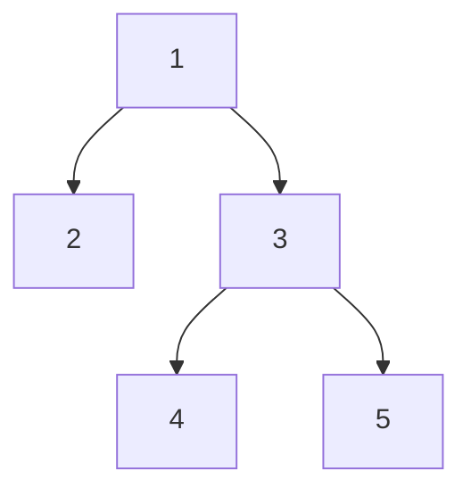
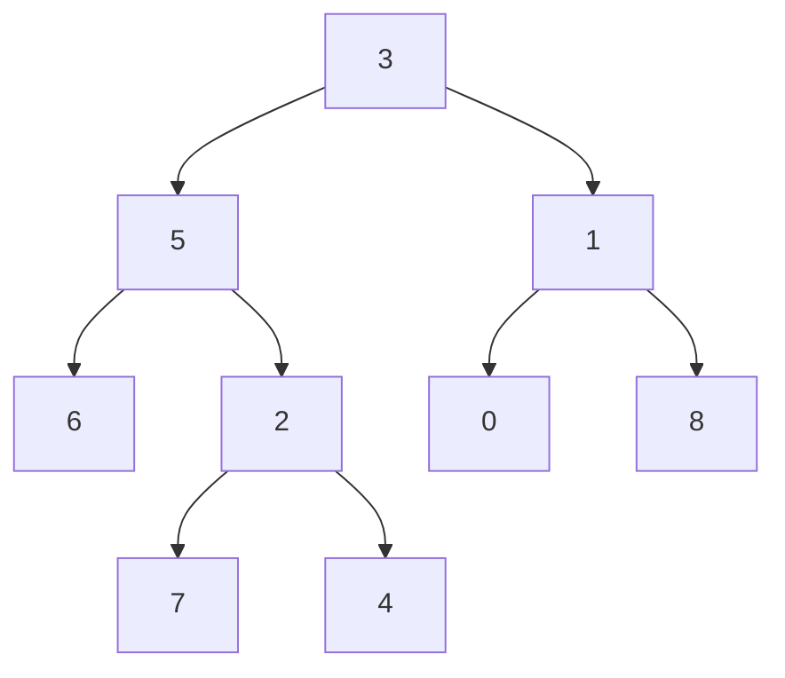

# 39.10-Trees
We’ve supplied you with a ***BinaryTreeNode*** class, a ***TreeNode*** class, a constructor for a ***BinaryTree*** class and a constructor for a more general ***Tree*** class (this will an ***n-ary*** tree).

## **Trees**

Here are descriptions of the methods you should write for ***Tree***:

### **sumValues**

Given a n-ary tree of integers, return the sum of all the integers.

### **countEvens**

Given a n-ary tree of integers, return the count of all the even integers.

### **numGreater**

Given a n-ary tree and a number x, find and return the number of nodes which are greater than x.

## **Binary Trees**

Here are descriptions of the methods you should write for ***BinaryTree***:

### **minDepth**

Given a binary tree, find its minimum depth. The minimum depth is the number of nodes along the shortest path from root node down to the nearest leaf node.

### **maxDepth**

Given a binary tree, find its maximum depth. The maximum depth is the number of nodes along the longest path from root node down to the nearest leaf node.

### **maxSum**

Given a binary tree, find the maximum path sum. The path may start and end at any node in the tree, but no node can be visited more than once.

### **nextLarger**

Given a binary tree and a integer x. Find and return the value of the node with next larger element in the tree i.e. find a node with value just greater than x. Return null if no node is present with value greater than x.

## **Further Study**

### **areCousins**

Given a binary tree and two nodes, determine whether the two nodes are cousins of each other or not.

Two nodes are cousins of each other if they are at same level and have different parents.

### **Serialize / Deserialize Binary Tree**

Serialization is the process of converting a data structure or object into a sequence of bits (i.e. a string) so that it can be stored in a file or memory buffer, or transmitted across a network connection link to be reconstructed later in the same or another computer environment.

Design an algorithm to serialize and deserialize a binary tree. Implement both of these methods as statics on the BinaryTree class.

There is no restriction on how your serialization/deserialization algorithm should work.

You just need to ensure that a binary tree can be serialized to a string and this string can be deserialized to the original tree structure.

For example, you may serialize the following tree



as “[1,2,3,null,null,4,5]”, just the same as how LeetCode serializes a binary tree.

You do not necessarily need to follow this format, so please be creative and come up with different approaches yourself.

You should make these pure functions, meaning you shouldn’t have to modify the input tree at all.

```jsx
let root = new BinaryTreeNode(1);
root.left = new BinaryTreeNode(2);
root.right = new BinaryTreeNode(3);
root.right.left = new BinaryTreeNode(4);
root.right.right = new BinaryTreeNode(5);

let myTree = new BinaryTree(root);
console.log(myTree);

/*
BinaryTreeNode {
  val: 1,
  left: BinaryTreeNode { val: 2, left: null, right: null },
  right:
  BinaryTreeNode {
    val: 3,
    left: BinaryTreeNode { val: 4, left: null, right: null },
    right: BinaryTreeNode { val: 5, left: null, right: null } } }
*/

let serialized = BinaryTree.serialize(myTree);
let deserialized = BinaryTree.deserialize(serialized);

console.log(deserialized);

/*
TreeNode {
  val: 1,
  left: TreeNode { val: 2, left: null, right: null },
  right:
  TreeNode {
    val: 3,
    left: TreeNode { val: 4, left: null, right: null },
    right: TreeNode { val: 5, left: null, right: null } } }
*/
```

Credit: https://leetcode.com/problems/serialize-and-deserialize-binary-tree/description/

### **lowestCommonAncestor**

Given a binary tree, find the lowest common ancestor (LCA) of two given nodes in the tree.

According to the definition of LCA on Wikipedia: The lowest common ancestor is defined between two nodes v and w as the lowest node in T that has both v and w as descendants (where we allow a node to be a descendant of itself). https://en.wikipedia.org/wiki/Lowest_common_ancestor

Notes

Both arguments (p and q) are instances of BinaryTreeNode.

Your return value should also be a BinaryTreeNode.

You can assume that all the values in the tree are unique.

Examples



```jsx
const root = new BinaryTreeNode(3);
const tree = new BinaryTree(root);

/* build left subtree */

const left = new BinaryTreeNode(5);
root.left = left;

const leftLeft = new BinaryTreeNode(6);
left.left = leftLeft;

const leftRight = new BinaryTreeNode(2);
left.right = leftRight;

const leftRightLeft = new BinaryTreeNode(7);
leftRight.left = leftRightLeft;

const leftRightRight = new BinaryTreeNode(4);
leftRight.right = leftRightRight;

/* build right subtree */

const right = new BinaryTreeNode(1);
root.right = right;

const rightLeft = new BinaryTreeNode(0);
right.left = rightLeft;

const rightRight = new BinaryTreeNode(8);
right.right = rightRight;

/* test examples */

// root = 3, p = 5, q = 1
tree.lowestCommonAncestor(left, right);
// --> root (3) is the LCA

// root = 3, p = 2, q = 7
tree.lowestCommonAncestor(leftRight, leftRightLeft);
// --> leftRight (2) is the LCA

// root = 3, p = 7, q = 6
tree.lowestCommonAncestor(leftRightLeft, leftLeft);
// --> left (5) is the LCA

// root = 3, p = 8, q = 0
tree.lowestCommonAncestor(rightLeft, rightRight);
// --> right (1) is the LCA
```

### **path sum**

https://leetcode.com/problems/path-sum/

### **path sum 2**

https://leetcode.com/problems/path-sum-ii/

### **getElementById**

Implement your own getElementById function. Here are some hints:

- Use helper method recursion, it will be much easier!
- In your outer function, store a variable that will either be the element found or null if the element can not be found.
- In your inner function, iterate over an elements children and if you find the correct.
- Invoke your inner function and pass in document.body.children so you start from the root of the DOM.

### **getElementsByTagName**

Implement your own getElementsByTagName function. This function should accept a string and return an array of DOM elements that have that tag name.

### **getElementsByClassName**

Implement your own getElementsByClassName function. This function should accept a string and return an array of DOM elements that have that class name.

## Solution
